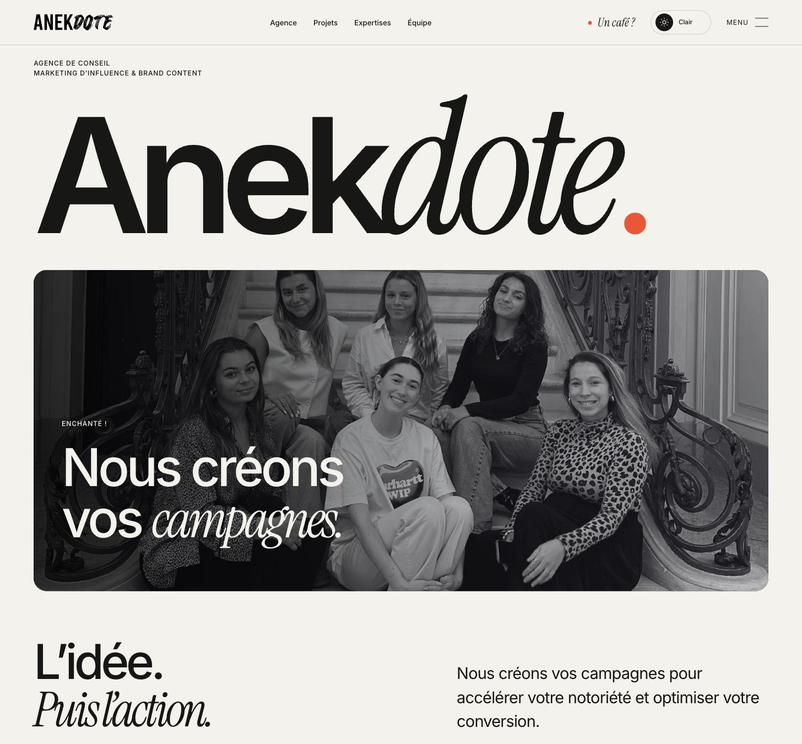

# Anekdote — Editorial × Human × Proof

Refonte intégrale en HTML, CSS et JavaScript. Site statique, médias et polices locaux, sans framework ni compilation nécessaire pour le consulter.

## Aperçus



[Voir la composition mobile](docs/previews/accueil-mobile.jpg) · [Équipe](docs/previews/equipe-raphael-desktop.jpg) · [Solar Metrics](docs/previews/solar-metrics-desktop.jpg) · [Projets](docs/previews/projets-editorial-desktop.jpg)

## Contenu

- 33 projets en compositions régulières avec image, paragraphe et zone de KPI ; études de cas complètes et chiffres animés.
- 6 expertises, agence, équipe de 7 personnes, talents.
- Accueil centré sur l’agence et les expertises, deux bandeaux de logos à sens opposés.
- Agence à flèche unique et frappe rapide ; manifeste automatique toutes les trois secondes et témoignages Talents en carrousel manuel.
- Christelle en portrait complet indépendant ; six membres en carrousel, photo carrée et paragraphe de même hauteur, goûts sur la photo.
- Newsroom supprimée de l’expérience et des routes publiques, à la demande du client.
- Contact en trois étapes, pages légales et conservation des anciennes routes.
- 58 fichiers HTML, dont 9 redirections et une page 404.

L’audit porte sur les pages publiques accessibles le 6 octobre 2026 depuis [anekdote.fr](https://www.anekdote.fr/). Les informations commerciales, citations, biographies et résultats proviennent de ce site. Les nouveaux intertitres et compositions éditoriales organisent ces contenus ; ils ne créent pas de nouvelles réalisations ou de nouveaux résultats.

## Consulter

Ouvrir `index.html` ou lancer un petit serveur à la racine :

```sh
python3 -m http.server 8765
```

Puis ouvrir `http://localhost:8765/`. Aucun accès au Drive n’est nécessaire.

## Organisation

```text
index.html                 Accueil
agence/                    Agence
expertises/                Vue d’ensemble
campagne-dinfluence/        Pages des six expertises (URLs historiques)
strategie/ · evenements/ · brand-content/
rse-corporate/ · performance-affiliation/
hub-projets/               Portfolio de 33 projets
projets/                   Études de cas et anciennes archives
équipe → equipe/           Équipe
talents/ · contact/
assets/                    Images WebP, SVG, vidéos MP4, polices WOFF2
css/ · js/                 Styles et interactions
content/                   Contenus et snapshots publics audités
docs/                      Audit, DA, sources, contrôles et manifestes
scripts/                   Reconstruction et validation hors navigateur
```

## Modifier et reconstruire

Les pages HTML sont directement utilisables et modifiables. Pour garder une édition cohérente de toutes les pages, modifier `scripts/build.py`, `content/site-content.json` ou les styles, puis :

```sh
python3 -m venv .venv
.venv/bin/pip install -r requirements.txt
.venv/bin/python scripts/build.py
.venv/bin/python scripts/check_site.py
```

Le générateur utilise les snapshots publics conservés dans `content/source-html/*.html.txt`, pas le site distant. `scripts/restore_media.py` sert uniquement à restaurer un fichier média manquant depuis son URL publique d’origine ; il nécessite FFmpeg pour les vidéos. Il n’est jamais exécuté à la consultation du site.

## Déploiement GitHub Pages

Le dépôt contient le workflow `.github/workflows/pages.yml`. Dans **Settings → Pages**, choisir **GitHub Actions** comme source. Le workflow vérifie les pages, prépare un dossier public et le publie. Aucun serveur Node ou Python n’est nécessaire en production.

Les liens internes sont relatifs : le site accepte le sous-répertoire `/MAQUETTE-ANEKDOTE/`. Les URL canoniques et le sitemap conservent le domaine final Anekdote ; l’hébergement GitHub constitue une maquette consultable.

## Points de reprise

Le formulaire utilise le destinataire technique existant d’Anekdote, Contact Form 7 n°547. La validation et les trois étapes ont été testées, ainsi que la réponse CORS du serveur. Aucun message de test n’a été envoyé : la réception effective d’un email reste à vérifier avec l’agence avant remplacement du site de production. L’interface confirme l’envoi uniquement si le serveur renvoie `mail_sent` et propose le formulaire original en cas d’échec.

L’adresse Anekdote est corrigée partout en 29 rue de Mogador, 75009 Paris. Les autres textes légaux historiques restent conservés : références à WordPress / hébergeur / prestataire et libellé d’email incomplet. Ils devront être validés par Anekdote pour le nouvel hébergement ; aucune information légale inconnue n’a été inventée.

La charte Drive cite PP Editorial New Italic. En l’absence de fichier web et de licence web fournis, cette version utilise Instrument Serif, libre sous OFL, avec Inter. Les deux polices sont hébergées localement ; leurs licences sont dans `assets/fonts/`.

## Révision du 6 octobre 2026

Les annotations et modifications demandées sont détaillées dans [MODIFICATIONS.md](docs/MODIFICATIONS.md). Les contenus source et l’audit initial restent archivés pour la traçabilité ; les anciens articles ne sont plus publiés.

Le bouton soleil/lune de l’en-tête permet de choisir le thème clair ou sombre. Le choix est conservé d’une page et d’une visite à l’autre ; la première visite suit la préférence du système. L’animation circulaire respecte le mouvement réduit. [Aperçu des deux thèmes](docs/previews/themes-clair-sombre.jpg). Les contrôles du thème peuvent être relancés avec `node scripts/check_theme.cjs`.

## Documentation

- [Audit et arborescence](docs/AUDIT.md)
- [Direction artistique et interactions](docs/DIRECTION-ARTISTIQUE.md)
- [Sources et droits](docs/SOURCES.md)
- [Contrôles et performances](docs/VALIDATION.md)
- [Activation de GitHub Pages](docs/DEPLOIEMENT.md)
- [Pages](docs/routes.json) et [médias](docs/assets.json)

Le code de cette livraison et les éléments de marque doivent être utilisés dans le cadre du projet Anekdote. Les photos, vidéos, campagnes, logos et citations restent ceux de leurs ayants droit respectifs. Les licences OFL s’appliquent aux polices concernées.
